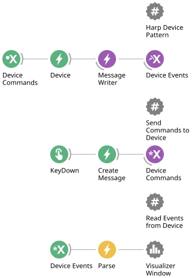

## About These Examples

The following articles cover how to operate the device in Bonsai. Each article walks through either a specific function on the device or a set of input/output ports. If an example requires specific hardware connections, there will be a link to the relevant connection instructions.

Every article begins with a complete top-level workflow that you can copy and paste into Bonsai to get started immediately. A workflow is made up of these three basic building blocks:

- A Harp device pattern that sets up the device, present in every workflow
- Blocks that send commands to the device
- Blocks that read events from the device



Each block is headed by an annotation node (# symbol) with a title describing what it does. The top-level workflow is followed by sections explaining each block in more detail. Since it can be helpful to learn how to build individual sections instead of copying the workflow, each article also gives step-by-step instructions on which operators to add and how to configure them.

> [!NOTE]
> You can find and add these operators to the workflow from the Bonsai [Toolbox](https://bonsai-rx.org/docs/articles/editor.html?tabs=mouse-controls#toolbox). This article uses the generic operators from the `Bonsai.Harp` package to better illustrate the concept. When following the examples in the later articles, make sure to use the device-specific versions, e.g. `Device (Harp.Behavior)` from the `Harp.Behavior` package instead of the generic `Device (Harp)` operator or another device's version. If correctly selected, the names of these operators in the workflow panel change to reflect the device name.

### Harp Device Pattern

The [Harp device pattern](https://harp-tech.org/articles/operators.html#device-pattern) is the first block you need in every workflow. It initializes the device, logs data, and provides hooks to send commands as well as receive messages from a Harp device according to the Harp [communication protocol](https://harp-tech.org/protocol/BinaryProtocol-8bit.html).


The block is made up of:

- A [`BehaviorSubject`] operator named `Device Commands` that collects all the commands that are sent to it from elsewhere in the workflow and forwards them to the device.
- A [`Device`] operator that establishes the serial communication link with the device.
- A [`MessageWriter`] operator that saves the messages or data from the device. The device-specific package will use a dedicated [`DeviceDataWriter`] named after the device.
- A [`PublishSubject`] operator that broadcasts the message stream as a `Device Events` subject.

### Send Commands to Device

Some blocks are used to send commands to the device, which requires a trigger. There are different ways to trigger commands, but in this guide the examples will use keyboard keys as the trigger. 


The block is made up of:

- A [`KeyDown`] operator that triggers the next operator to execute when a specific key is pressed.
- A [`CreateMessage`] operator that formats the command to send to the device.
- A [`MulticastSubject`] operator that sends the command to the `Device Commands` subject.

> [!NOTE]
> In a real-world application, keyboard presses would be replaced by control logic in Bonsai to convert the Harp example workflows into experimental workflows. For instance, a [`Timer`] can be used instead of [`KeyDown`] to trigger the command at a set time after the workflow starts.

### Read Events from Device

Other blocks are used to read events from the device, selecting and decoding messages to display.


The block is made up of:

- A [`SubscribeSubject`] operator that subscribes to the `Device Events` message stream.
- A [`Parse`] operator that picks out the messages corresponding to one register and decodes its values.
- A [`VisualizerWindow`] that automatically opens a window and displays the decoded values when the workflow starts.

Sections that read events from devices also include a text sample of the visualizer display along with a description of what the values mean:

```text
13@10.351072
```

### Additional Resources

For more, see:

- The Bonsai-Harp interface package [documentation](https://harp-tech.org/articles/operators.html) to learn more about Harp operators.
- The Harp [website](https://harp-tech.org/protocol/BinaryProtocol-8bit.html) for more information on how Harp works.
- The Bonsai [documentation](https://bonsai-rx.org/docs/) to learn more about Bonsai control logic.

[!INCLUDE [](version-footer.md)]

<!--Reference Style Links -->
[`BehaviorSubject`]: xref:Bonsai.Reactive.BehaviorSubject
[`CreateMessage`]: xref:Bonsai.Harp.CreateMessage
[`Device`]: xref:Bonsai.Harp.Device
[`DeviceDataWriter`]: xref:Harp.Behavior.DeviceDataWriter
[`KeyDown`]: xref:Bonsai.Windows.Input.KeyDown
[`MessageWriter`]: xref:Bonsai.Harp.MessageWriter
[`MulticastSubject`]: xref:Bonsai.Expressions.MulticastSubject
[`Parse`]: xref:Bonsai.Harp.Parse
[`PublishSubject`]: xref:Bonsai.Reactive.PublishSubject
[`SubscribeSubject`]: xref:Bonsai.Expressions.SubscribeSubject
[`Timer`]: xref:Bonsai.Reactive.Timer
[`VisualizerWindow`]: xref:Bonsai.Design.VisualizerWindow
