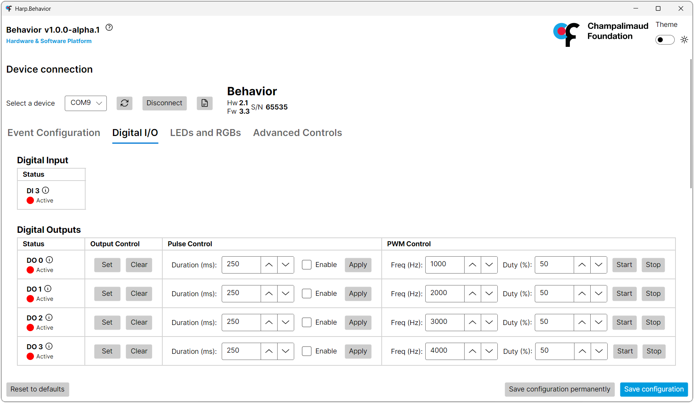

## Behavior GUI

The Behavior GUI is a standalone visual interface for configuring and testing the device without using Bonsai.

Before beginning, [install the GUI](installation.md#software-packages), follow the hardware setup [guide](connections.md), and connect the USB cable to the computer. Launch "Harp.Behavior.App" from the Windows Start menu.

> [!NOTE]
> This is a pre-release version of the app, there have been changes since [then](https://github.com/harp-tech/device.behavior/pull/32), but binaries have not been generated. Remember to update the screenshots and add numbered labels for the new version.

1) Select the port for the device, and press "Connect". The device details will display on the right side if it is successfully connected.
2) Select the tab for the register group that you want to control.
3) Change the values to test outputs, LEDs, cameras, and servos, and observe the output on the connected periperals.

> [!WARNING]
> Only one program can access the device's COM port at a time. Close the GUI before starting a Bonsai workflow that uses the device.

[!INCLUDE ]
