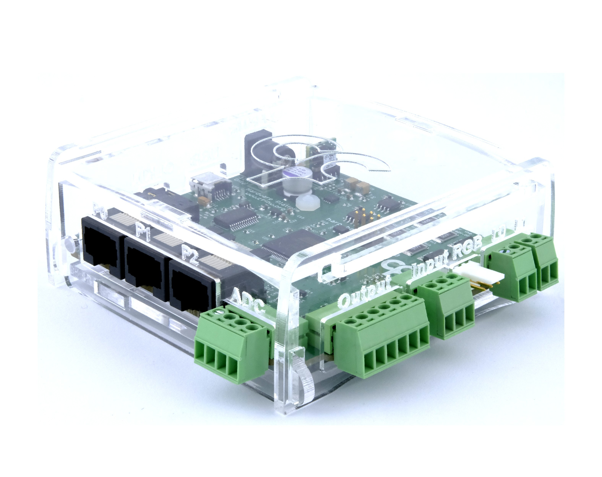

## Behavior

{width=450}

### Key Features

- 3 peripheral ports, each combining an infrared beam input, an LED driver, a 12 V valve driver, and a general-purpose digital line.
- Timed pulses and PWM (up to 10 kHz with configurable duty cycle) on every digital output.
- Camera triggering, servo motor control, and quadrature encoder counting on the general-purpose outputs and ports.
- Configurable LED drive current (up to 100 mA) with a settable maximum limit.

### Specs

- Analog inputs: 2 (12-bit, sampled at 1 kHz)
- Digital inputs: 1 (**DI3**, 5 V)
- General-purpose digital outputs: 4 (5 V, with pulse and PWM support)
- PWM frequency: 1 Hz – 10 kHz, duty cycle 1 – 99%
- Peripheral ports: 3 (**P0**–**P2**; IR input, LED, 12 V valve, and DIO line per port)
- LED outputs: 2 (**L0**/**L1**, 2 – 100 mA drive current)
- RGB LED outputs: 2 (WS2812-type addressable LEDs on the **RGB** connector, driven as a serial chain)
- Camera triggers: 2 (**DO0**/**DO1**, 2 – 600 Hz)
- Servo outputs: 2 (**DO2**/**DO3**, period and pulse width in µs)
- Quadrature encoder inputs: 1 (on **P2**, read at 1 kHz)
- Output pulse duration: 1 – 65535 ms
- Timestamp resolution: 32 µs
- Synchronization frequency: 1 Hz
- Synchronization accuracy: 22 ± 16 µs (between clock generator and this device)

### Hardware

| Version | Notes |
| ------- | ----- |
| 2.0 | <ul><li> Current version, documented in this guide </li></ul> |
| 1.2 | <ul><li> Earlier revision, uses case_v1.1_v1.2 enclosure </li></ul> |
| 1.1 | <ul><li> Earlier revision, uses case_v1.1_v1.2 enclosure </li></ul> |

> [!WARNING]
> **TODO**: Fill in what changed between hardware revisions 1.1, 1.2, and 2.0 (e.g. second analog input, connector changes). The repository records only the current 2.0 design files.

### Firmware

| Version | Notes |
| ------- | ----- |
| 3.4 | <ul><li> Aligned firmware register naming with the interface and `device.yml` </li></ul> |
| 3.3 | <ul><li> Fixed the read function of the digital inputs register </li></ul> |
| 3.2 | <ul><li> Added the `EncoderMode` register </li></ul> |
| 3.1 | <ul><li> Added an event when the last trigger is sent to the camera after stopping </li><li> Cameras stop when the device goes to standby mode </li><li> Added serial timestamp registers </li></ul> |

> [!WARNING]
> **TODO**: The firmware notes above were derived from commit messages between release tags. Verify them against the release notes on the [releases page](https://github.com/harp-tech/device.behavior/releases), and extend the table with older releases if needed.

[!INCLUDE ]
