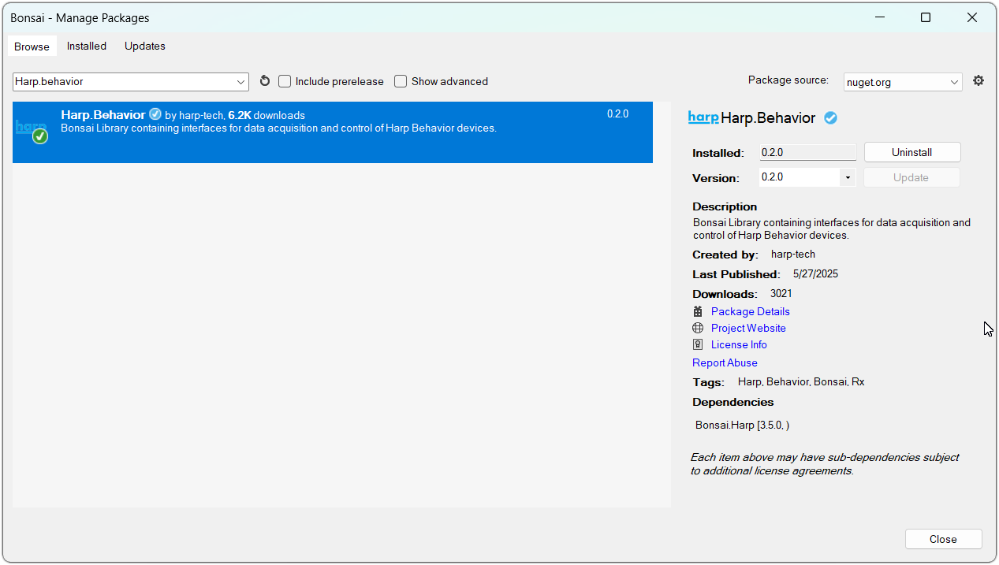

## Installation

This page covers the software you'll need to interact with the Behavior board, as well as how to update the firmware on the device.

## Software Packages

These steps are only required the first time you connect the device to a new computer, and you can install just the packages for the functionality you need.

# [Bonsai](#tab/bonsai)

[Bonsai](https://bonsai-rx.org/) is a visual reactive programming language that provides flexible and comprehensive control of the Behavior board.

{width=600}

- Download and install [Bonsai](https://bonsai-rx.org/docs/articles/installation.html).
- Launch Bonsai and install the `Harp.Behavior` package by searching for it in the [Bonsai package manager](https://bonsai-rx.org/docs/articles/packages.html).
- (Optional) Install the `Bonsai.Windows.Input` package to follow along with the examples in this user guide.

# [harp-python](#tab/harp-python)

The [harp-python](https://pypi.org/project/harp-python/) library is a Python package for [loading and manipulating](logging-analysis.md) binary data collected from Harp devices. Install it in a Python environment with:

```cmd
pip install harp-python
```

# [GUI](#tab/gui)

The [Behavior GUI](behavior-gui.md) is a standalone graphical application for configuring and testing the device without using Bonsai.

{width=600}

- Download and install the [Behavior GUI](https://github.com/fchampalimaud/device.behavior/releases).

***

## Firmware

New features are added and bugs are fixed with firmware updates which are published on the [release page](https://github.com/harp-tech/device.behavior/releases) in the Behavior repository. Each firmware release is tagged with a `fw` version prefix (e.g. `fw3.3-harp1.15`), and the `.hex` files can be found in the "Assets" section. Download the file that matches the hardware (`hw`) version of your device.

>[!TIP]
> The hardware version is printed on the PCB silkscreen (e.g. `harp behavior v2.0`).

To update the firmware, use the device setup tool in Bonsai:

[placeholder - installation-firmwareupdate.png]

1. Add the [`Device`] operator in Bonsai.
2. Double-click on the [`Device`] node while the workflow is not running.
3. Select the COM port for the device.
4. Click "Bootloader".
5. Click "Open".
6. Select the downloaded `.hex` file.
7. Click "Update".

After the update, the device will reboot with the new firmware and go through the [startup LED sequence](troubleshooting.md#indicator-lights).

[!INCLUDE [](version-footer.md)]

<!--Reference Style Links -->
[`Device`]: xref:Harp.Behavior.Device
