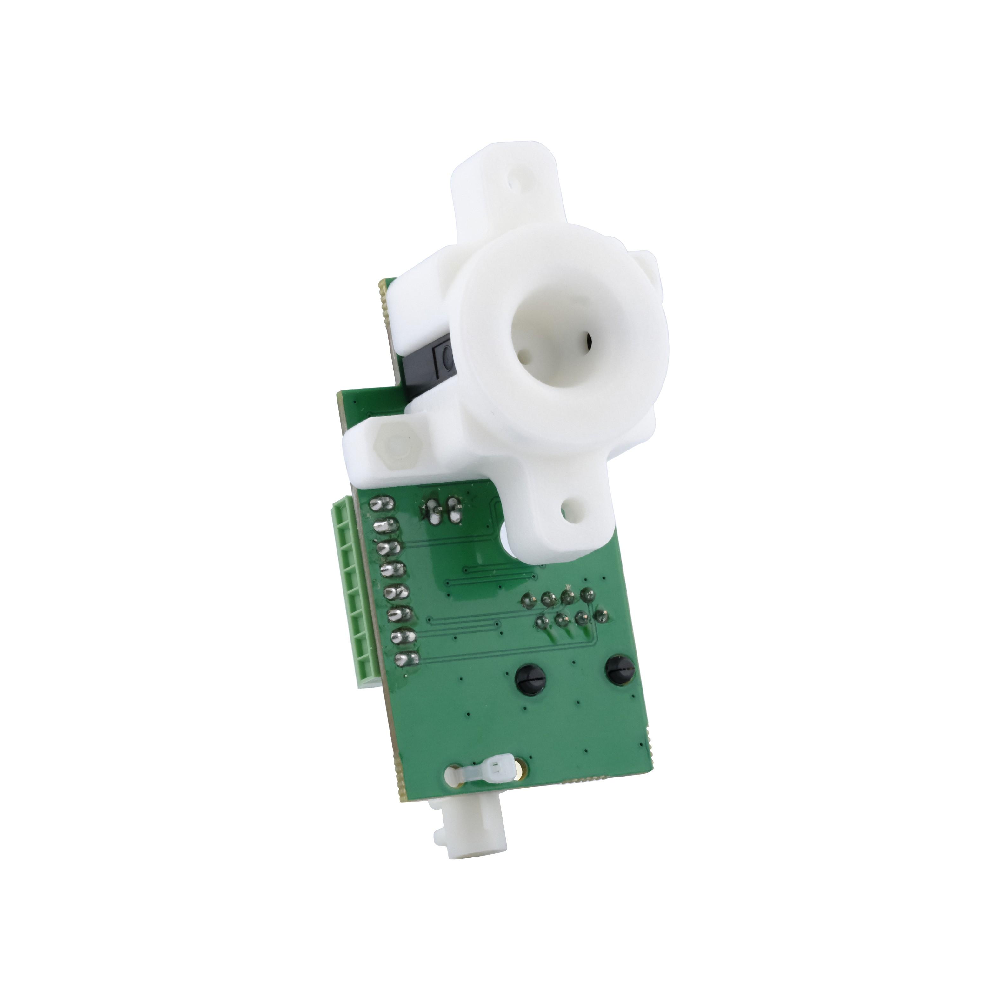

## Mice Poke

The Harp Mice Poke is a nose-poke peripheral for the Behavior board. It detects pokes with an infrared beam, drives onboard cue LEDs, and controls a solenoid valve for reward delivery.

{width=450}

### Key Features

- Infrared beam poke detection.
- Control of 2 onboard LEDs, with the option of connecting an external LED.
- 12 V solenoid valve control for reward delivery.
- Connects directly to a Behavior board peripheral port with a standard Ethernet cable (RJ45).

### Ports

- RJ45 connector: Connects to a Behavior board [peripheral port](../connections.md) with a straight-through cable for direct control.
- Screw terminals: Alternative interface for operating the Mice Poke with other external devices. Contains the following pins:
    - 1x 5V supply (+5V)
    - 3x Ground (GND)
    - 1x External LED drive (LED)
    - 1x Infrared detector output (IR_PHT)
    - 1x Infrared emitter (IR_LED)
    - 1x Digital Input / Output (DIO1)
    - 1x 12 V solenoid valve
    - 1x solenoid valve return

> [!NOTE]
> Depending on the [hardware version](../behavior-overview.md), some of the ports above may be different. Always check the printed label on the PCB.

### Hardware

| Version | Compatible Behavior Board | Notes |
| ------- | ------------------------- | ----- |
| 1.4 | > 1.0 | <ul><li> Update valve footprint </li><li> Increased LED resistor</li></ul> |
| 1.3 | > 1.0 | <ul><li> To document </li></ul> |
| 1.2 | > 1.0 | <ul><li> To document </li></ul> |

Assembled units are available from the [Open Ephys store](https://open-ephys.org/harp), or build your own using the hardware design files in the [Mice Poke](https://github.com/harp-tech/peripheral.micepoke) repository.

> [!NOTE]
> Three variants are available from the Open Ephys store, choose the right variant for your needs:
> - OEPS-3007 - PCB only
> - OEPS-3008 - Includes mice poke enclosure, no water valve
> - OEPS-3010 - Includes mice poke enclosure and water valve

[!INCLUDE ]
