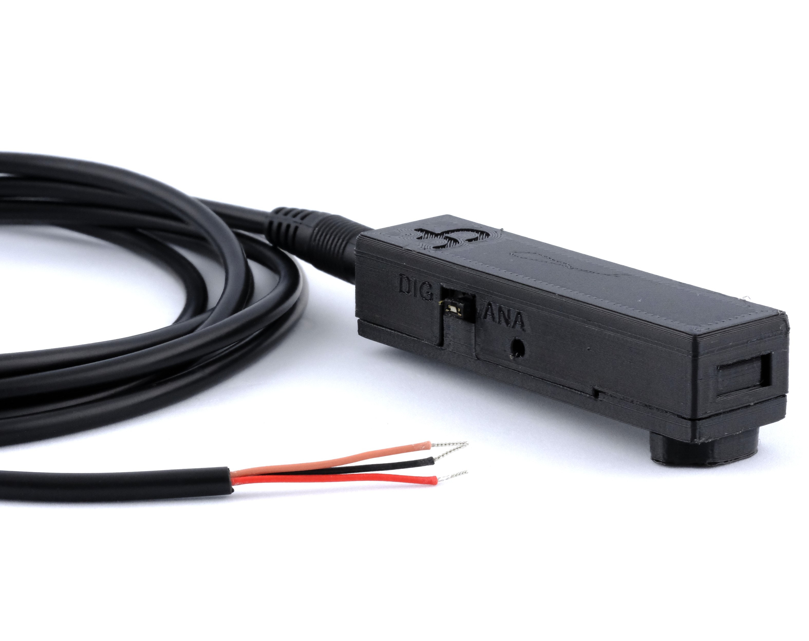

## Photodiode

The Harp Photodiode is a light-measuring peripheral for the Behavior board. It outputs either an analog signal of the light intensity or a thresholded digital pulse, for instance to detect stimulus onsets on a screen.

{width=450}

### Key Features

- Onboard photodiode.
- Jumper setting to switch between analog output (**ANA**) or digital output (**DIG**).
- Adjustment screw to set the threshold for digital output.
- Powered from the Behavior board's 5 V supply.

### Specs

- Photodiode: Advanced Photonix PDB-C156-ND
- Connector: 3.5 mm stereo jack for stereo plug cable carrying 5 V, ground and signal wire.

### Hardware

| Version | Compatible Behavior Board | Notes |
| ------- | ------------------------- | ----- |
| 2.3 | >1.0 | <ul><li> Initial version </li></ul> |

Assembled units are available from the [Open Ephys store](https://open-ephys.org/harp). 

> [!NOTE]
> The [hardware repository](https://github.com/harp-tech/peripheral.lightdetector) is private and incomplete, if we want to link to it, it needs to be polished and made public.

[!INCLUDE ]
