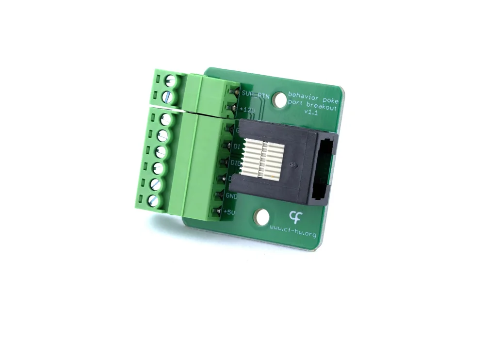

## Breakout

The Breakout is an interface peripheral for the Behavior board that makes the pins of the Behavior board [poke ports](../connections.md) available on screw terminals without building a custom cable.

{width=450}

### Key Features

- Allows the control of a 12V valve (e.g. Lee LHD series) (v1.1 only).
- Allows the use of the Behavior board serial TX instead of the valve return pin, with the logic level selected by the onboard jumper (v2.x only).

### Ports

- 1x Digital Input (DI)
- 1x Digital Input / Output (DIO)
- 1x Digital Output (DO)
- 1x 5V supply (+5V)
- 1x Ground (GND)
- 1x 12V supply (+12V) (v1.1 only)
- 1x Supply return (compatible for +5V and +12V) (SUP_RTN) (v1.1 only)
- 1x Serial TX (v2.x only)

For connection with a quadrature encoder:

| Quadrature encoder pin | Breakout board pin |
|---------------------   |------------------  |	                               
| A                      | DI 	              | 
| B                      | DIO 	              |
| Supply                 | +5V                |
| Ground                 | GND                | 

### Hardware

| Version | Compatible Behavior Board | Notes |
| ------- | ------------------- | ----- |
| 2.x | > 2.0 | <ul><li> Serial TX terminal replaces the +12V and SUP_RTN terminals </li><li> TX logic level jumper-selectable between 3.3 V and 5 V </li></ul> |
| 1.1 | > 1.2 | <ul><li> Release version </li></ul> |

Assembled units are available from the [Open Ephys store](https://open-ephys.org/harp), or build your own using the hardware design files in the [Breakout](https://github.com/harp-tech/peripheral.portbreakout) repository.

[!INCLUDE ]
