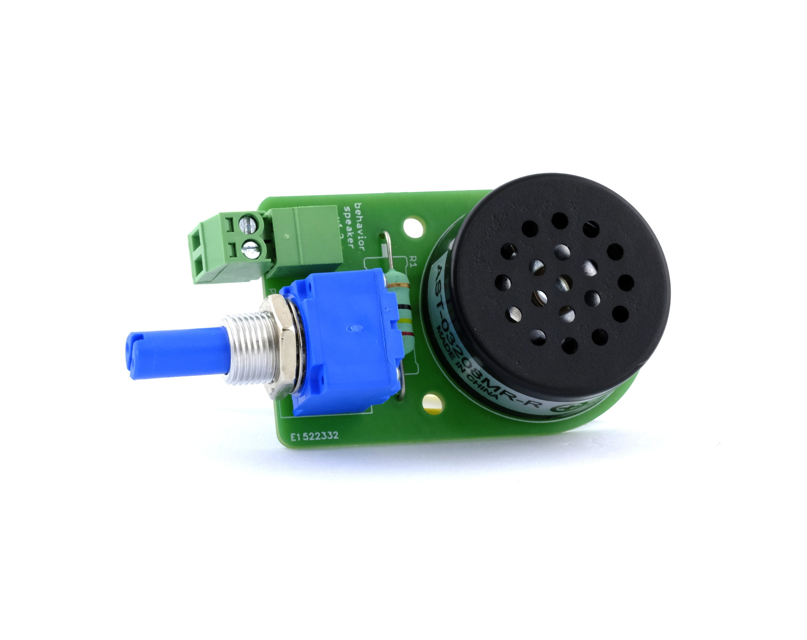

## Speaker

The Harp Speaker is a sound output peripheral for the Behavior board. It connects to one of the general-purpose digital outputs and turns the board's [PWM signal](../generate-pwm.md) into an audible tone.

{width=450}

> [!NOTE]
> The Harp Speaker is meant for playback of simple tones. For audio stimulation with complex stimuli and high precision, consider using the Harp [Sound Card](https://github.com/harp-tech/device.soundcard).

### Key Features

- Onboard speaker driven directly by a digital output.
- Volume potentiometer to adjust the amplitude.
- Screw terminal for wiring, no soldering needed.

### Specs

- Input signal: 5 V PWM
- Speaker: PUI Audio AST-03208MR-R
- Frequency range: 500 Hz – 10 kHz. 
- Connector: Screw terminal

> [!NOTE]
> While the speaker can go higher in range, the [PWM signal generation](../generate-pwm.md) on the Behavior board has a 10 kHz upper limit.

### Hardware

| Version | Compatible Behavior Board | Notes |
| ------- | ------------------- | ----- |
| 1.2 | > 1.0 | <ul><li> Fixed the volume direction </li></ul> |
| 1.1 | > 1.0 | <ul><li> Initial version </li></ul> |

Assembled units are available from the [Open Ephys store](https://open-ephys.org/harp).

> [!NOTE]
> The [hardware repository](https://github.com/harp-tech/peripheral.speaker) is private and incomplete, if we want to link to it, it needs to be polished and made public.

[!INCLUDE ]
