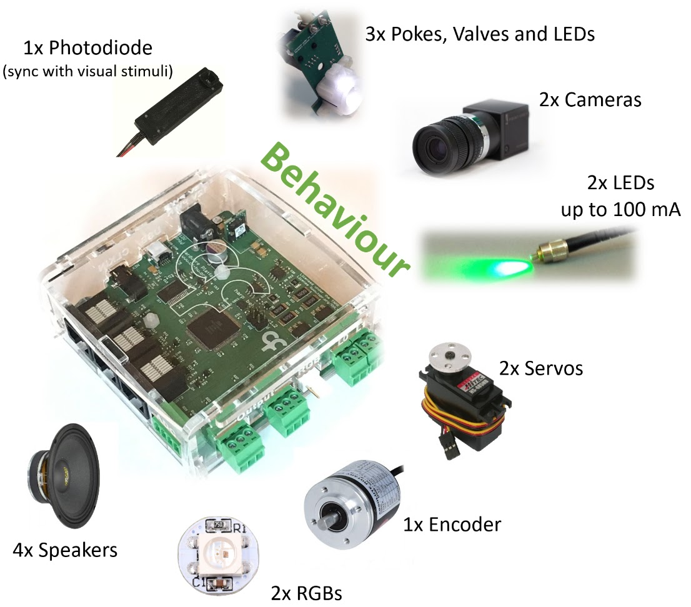

## Overview

The Harp [Behavior](articles/behavior-overview.md) board is a multi-purpose data acquisition and control device for behavioral neuroscience experiments.

{width=450}

A typical behavioral rig combines sensors, cue lights, reward valves, cameras and motorized actuators. These components usually need individual control interfaces and post-hoc alignment to a common timeline. The Behavior board brings them together on a single device, so that every input and output stream is controlled through one interface and timestamped on the same hardware clock.

The Behavior provides:

- General-purpose analog inputs, digital input and outputs for interfacing with external devices.
- Support for specialized peripherals like [nose pokes](articles/peripherals/peripherals-micepoke.md), camera triggers, servo motors, quadrature encoders and more.
- Hardware timestamping and synchronization with other [Harp](https://harp-tech.org/articles/about.html) devices.
- [Bonsai](https://bonsai-rx.org/) integration for flexible experiment acquisition and control.

## Getting a Device

Assembled units are available from the [Open Ephys store](https://open-ephys.org/harp), or build your own using the hardware design files in the [Behavior](https://github.com/harp-tech/device.behavior) repository.

## Acknowledgments

Hardware design and GUI contributed by [Champalimaud Foundation](https://www.cf-hw.org/), Bonsai interface by [NeuroGEARS](https://neurogears.org/), testing and feedback by [Allen Institute for Neural Dynamics](https://www.allenneuraldynamics.org/), and documentation by [Open Ephys](https://open-ephys.org/).

[!INCLUDE ]
